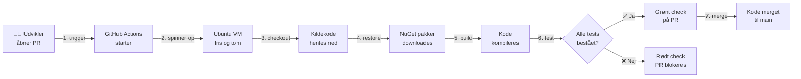
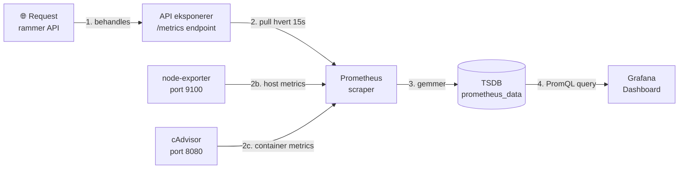
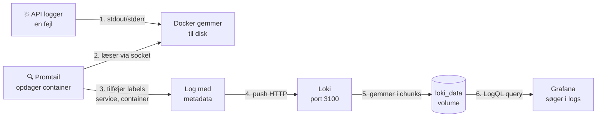
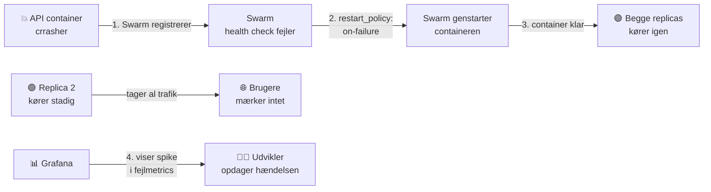
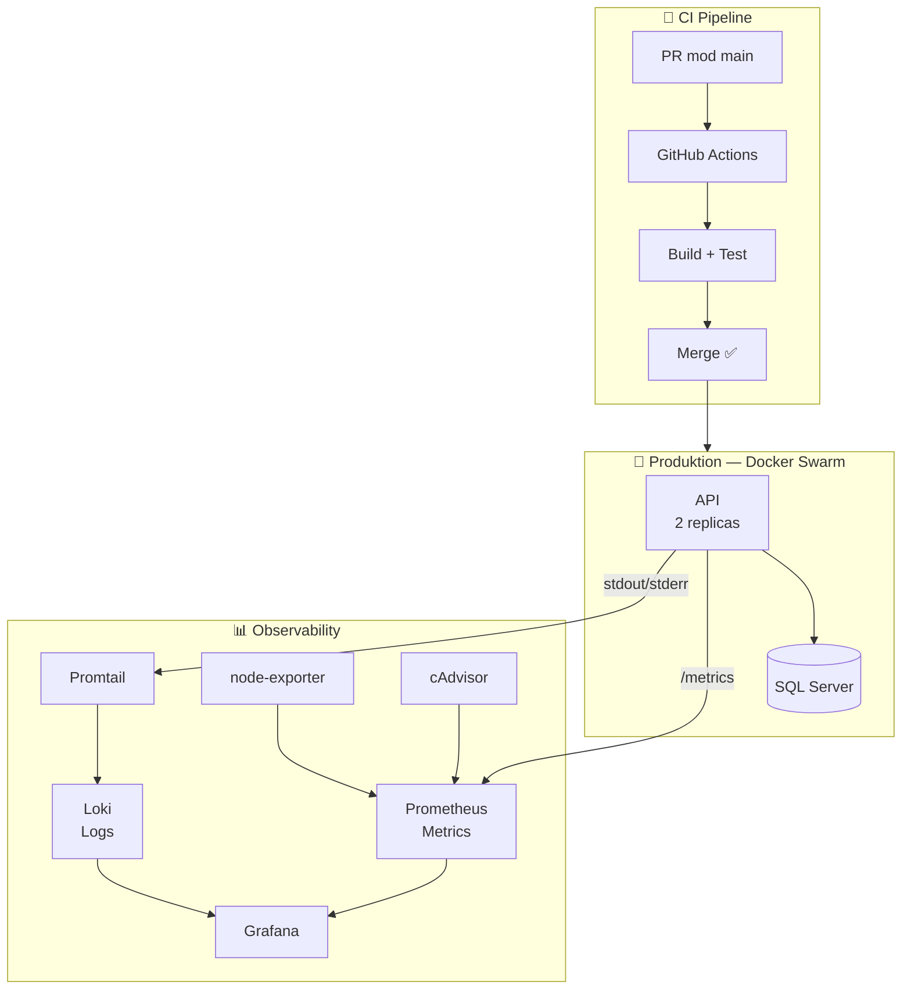

# DevOps Flows — Eksamensforberedelse

---

## 1. CI Pipeline Flow

> **Analogien:** Tænk på det som en tjekliste der automatisk køres hver gang du afleverer en opgave — ingen kan godkende den før tjeklisten er grøn.

**Hvorfor har vi det?** Uden CI kan en udvikler merge kode der ødelægger projektet for alle andre. CI sikrer at koden virker *inden* den rammer main.

- **Trin 1-2:** GitHub Actions registrerer PR'en og spinner en frisk Ubuntu VM op — den er tom og midlertidig hver gang
- **Trin 3-6:** Koden hentes, pakker installeres, koden kompileres og alle xUnit-tests køres i rækkefølge. `--no-restore` og `--no-build` sparer tid ved at undgå dobbeltarbejde
- **Trin 7:** Branch protection rules på GitHub kræver grønt check inden merge er muligt — det er ikke automatisk, det skal konfigureres

> **Til eksamen kan jeg sige:** *"Når jeg åbner en PR mod main, starter GitHub Actions automatisk en pipeline på en frisk Ubuntu VM. Den henter kildekode, installerer NuGet-pakker, kompilerer og kører alle tests. Fejler ét trin, får PR'en rødt kryds og kan ikke merges — det fanger fejl inden de rammer main."*

---

## 2. Observability Flow — Metrics

> **Analogien:** Tænk på Prometheus som en læge der tager blodprøver hvert 15. sekund og gemmer resultaterne. Grafana er skærmen der viser kurven over tid.

**Hvorfor har vi det?** Uden metrics ved vi ikke om API'et er langsomt, om serveren løber tør for RAM, eller om fejlraten stiger. Metrics giver os **tal over tid** så vi kan reagere proaktivt.

- **Trin 1-2:** API'et eksponerer passivt et `/metrics`-endpoint via `prometheus-net` NuGet-pakken. Prometheus **puller** aktivt hvert 15. sekund — tre jobs: api, node-exporter og cAdvisor
- **Trin 2b-2c:** node-exporter måler **host-maskinen** (CPU, RAM, disk). cAdvisor måler **per container** (hvor meget bruger API-containeren vs. DB-containeren?)
- **Trin 3:** Data gemmes som tidsserier i `prometheus_data`-volumet — historikken overlever container-genstarter og bevares i 15 dage (`retention.time=15d`)
- **Trin 4:** Grafana spørger Prometheus via PromQL og tegner grafer. Går API'et ned, viser Grafana en flad linje — men historikken inden nedbruddet er stadig synlig

> **Til eksamen kan jeg sige:** *"Prometheus puller metrics fra tre sources hvert 15. sekund: API'et, node-exporter der måler serveren, og cAdvisor der måler per container. Data gemmes i et volume så historikken overlever genstarter. Grafana viser det hele som grafer — vi kan se hvad der skete op til et nedbrud."*

---

## 3. Observability Flow — Logs

> **Analogien:** Tænk på Promtail som en postbud der løbende tømmer postkasserne (container-logs) og leverer dem til et arkiv (Loki). Grafana er søgesystemet i arkivet.

**Hvorfor har vi det?** Metrics fortæller os *at* noget gik galt — men ikke *hvad*. Logs fortæller os hvad der rent faktisk stod i fejlbeskeden. De to supplerer hinanden.

- **Trin 1-2:** API'et skriver til stdout/stderr — Docker gemmer det som JSON-filer på host-disken. Promtail opdager containeren automatisk via Docker socket hvert 5. sekund — ingen genstart nødvendig
- **Trin 3:** Promtail tilføjer tre labels til hver log-linje: `service="api"`, `container="vucfyn-api-1"`, `logstream="stdout/stderr"`. Uden labels ville alle logs havne i én ustruktureret bunke
- **Trin 4-5:** Promtail **pusher** aktivt til Loki (modsat Prometheus der puller). Loki gemmer logs i `loki_data`-volumet i 30 dage (`retention_period: 30d`)
- **Positions-filen** husker hvor Promtail er nået til i hver log-fil — genstarter Promtail, sendes ingen logs dobbelt
- **Trin 6:** I Grafana kan vi filtrere `{service="api"} |= "ERROR"` og se præcis hvad der stod i loggen da fejlraten steg

> **Til eksamen kan jeg sige:** *"Når API'et logger en fejl, skriver Docker det til disk. Promtail opdager containeren via Docker socket, tilføjer labels og pusher logs til Loki. I Grafana kan vi søge på labels som service='api' og finde præcis hvad der skete. Metrics viste os at noget gik galt — Loki fortæller os hvad."*

---

## 4. Container Crash-scenariet — Self-healing i Swarm

> **Analogien:** Tænk på Docker Swarm som en vagtleder der konstant holder øje med sine medarbejdere. Falder én om, ringer vagtlederen straks til en anden og får opgaven dækket — uden at kunderne bemærker noget.

**Hvorfor har vi det?** I `docker-compose.yml` er der ingen automatisk genstart. I `docker-stack.yml` med Swarm er der self-healing — systemet helbreder sig selv uden menneskelig indgriben.

- **Trin 1-2:** Swarm overvåger løbende alle containers. Crasher en container, træder `restart_policy: on-failure` i kraft automatisk — ingen manuel indgriben nødvendig
- **`replicas: 2`** er nøglen: mens den ene instans er nede, håndterer den anden al trafik. Brugerne oplever ingen downtime
- **Databasen** kører med `replicas: 1` og `node.role == manager` — den kører altid på manager-noden for datakonsistens. Går den ned genstarter Swarm den, men der vil være kortvarig downtime
- **Trin 4:** Selvom systemet helbreder sig selv, registrerer Grafana hændelsen som en spike i fejlmetrics og et hul i logs — vi kan efterfølgende undersøge hvad der skete
- I `docker-compose.yml` sker **ingen** automatisk genstart — self-healing er udelukkende en Swarm-feature fra `docker-stack.yml`

> **Til eksamen kan jeg sige:** *"I Swarm kører API'et med to replicas og restart_policy on-failure. Crasher én instans, registrerer Swarm det øjeblikkeligt og genstarter containeren automatisk. Den anden instans håndterer trafikken i mellemtiden så brugerne ikke mærker noget. Grafana viser os hvad der skete via metrics og logs — selvom systemet allerede har helbredt sig selv."*

---

## Samlet overblik

