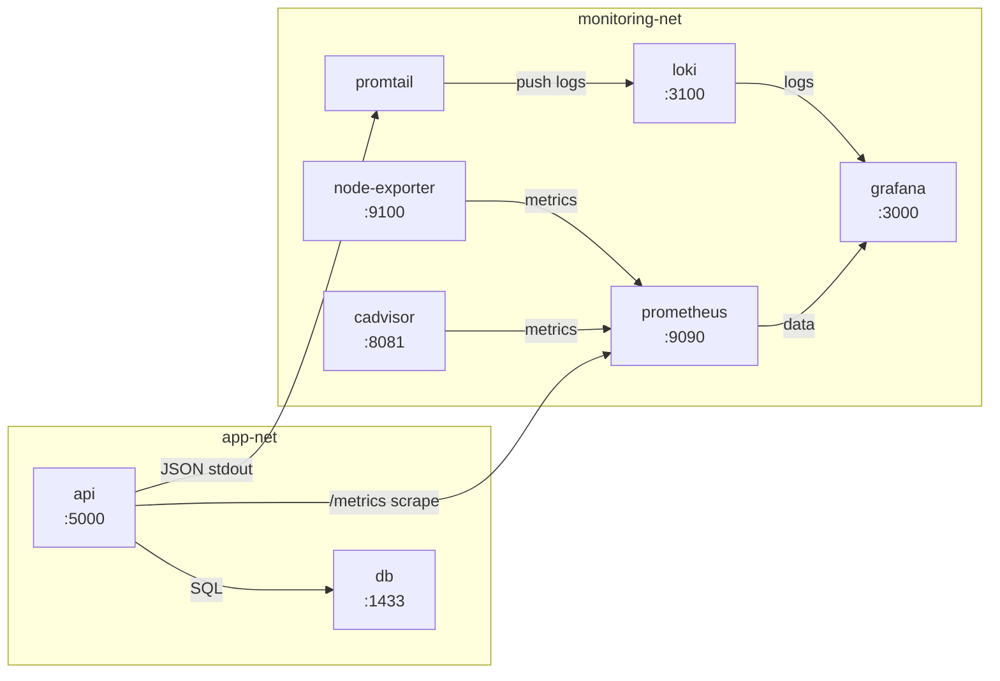
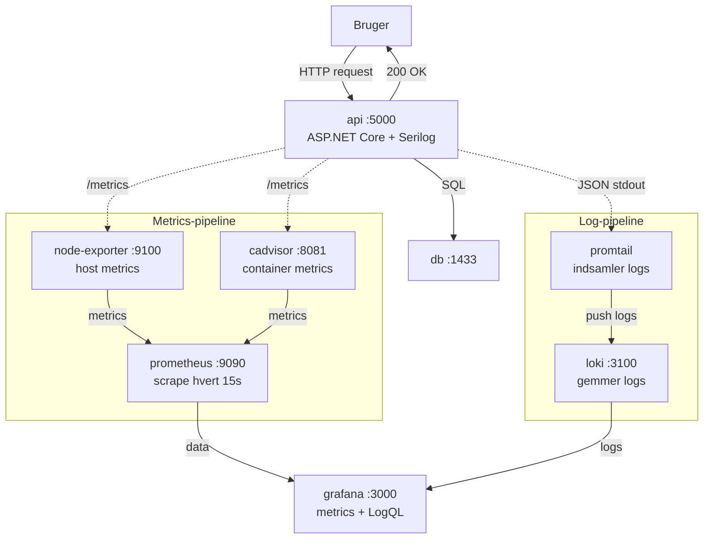

# VUC-Fyn — Opsætningsguide

Denne guide får dig fra et tomt repo-clone til en fuldt kørende lokal udviklingsstack med API, database, monitoring og logging.

---

## Sådan er DevOps-stacken designet

Inden du sætter det op, er det nyttigt at forstå hvad du starter. Stacken består af **8 separate Docker containers** fordelt på to ansvarsområder.

### De 8 containers

| Container | Formål | Port |
|---|---|---|
| `api` | ASP.NET Core API | 5000 |
| `db` | SQL Server 2022 — gemmer applikationsdata | 1433 |
| `prometheus` | Scraper og gemmer metrics som tidsserier | 9090 |
| `grafana` | Visualiserer metrics og logs i dashboards | 3000 |
| `loki` | Modtager og gemmer log-linjer | 3100 |
| `promtail` | Læser Docker-logs og sender dem til Loki | — |
| `node-exporter` | Indsamler host-metrics (CPU, RAM, disk) | 9100 |
| `cadvisor` | Indsamler container-metrics (hvad bruger hver container?) | 8081 |

> **Pensum:** Kenneth opsætter på samme måde i hans hans monotorerings materiale.

### To netværk — bevidst adskilt



- **app-net** — kun `api` og `db` taler sammen her. Databasen er ikke synlig for resten af stacken.
- **monitoring-net** hele observability-stakken. `api` er med på begge netværk så Prometheus kan scrape den.

### Komplet observability flow

Når en bruger sender et request sker tre ting parallelt:



> Stiplede pile viser data der sendes parallelt med det normale request-flow.

### Metrics-pipeline (tal og grafer)

API'en eksponerer et `/metrics`-endpoint via `prometheus-net`.
Prometheus scraper dette endpoint hvert 15 sekund og gemmer målingerne som tidsserier. Grafana henter data fra Prometheus og viser det i dashboards.

> **Pensum:** `scrape_interval: 15s` er direkte fra Kenneths `prometheus.yml` eksempel.

```
API (/metrics) ──▶ Prometheus (scrape hvert 15s) ──▶ Grafana (visualisering)
```

### Log-pipeline (tekstlogs)

API'en bruger **Serilog** til at skrive **strukturerede JSON-logs** til stdout. Docker opsamler alt fra containers som logfiler. Promtail overvåger disse filer og sender nye log-linjer til Loki. Grafana kan herefter søge i logs via LogQL.

> **Pensum:** Kenneth viser præcis denne pipeline: "App-containers → Promtail (indsamler) → Loki (gemmer) → Grafana (visualiserer)" -> Taget fra Kenneths eksempl.

```
API (JSON stdout) ──▶ Docker logs ──▶ Promtail ──▶ Loki ──▶ Grafana (LogQL)
```

Eksempler på LogQL queries i Grafana:
```
{service="api"} | json | level="error"
{service="api"} | json | StatusCode >= 500
```

### Dockerfile — multi-stage build

Dockerfilen bygger API'en i to trin:

1. **Stage 1 (build)** — .NET SDK-image: restore pakker, byg og publish
2. **Stage 2 (runtime)** — kun ASP.NET runtime-image: ingen SDK, ingen kildekode

> **Pensum:** Multi stage builds er direkte pensum fra Dag 3 med 03_Building_with_Docker: "Builder stage (tools, dev deps) → Runtime stage (kun det der skal køre) → Resultat: mindre images, færre angrebsflader". API'en kører desuden som non root bruger, hvilket Kenneth tydeligt fremhæver som et godt sikkerhedstiltag: "Hvis container kompromitteres → færre rettigheder".

### docker-compose.yml som IaC

`docker-compose.yml` fungerer som projektets primære Infrastructure as Code artefakt.

> **Pensum:** Kenneth kategoriserer Docker Compose som et IaC værktøj under "container-orkestrering" og beskriver desired state-princippet: "Du beskriver målet — ikke fremgangsmåden" — DevOps_07_IaC_Monitoring.

### Automatisk database-migrering og seed

Når API'en starter første gang, kører den automatisk:

1. `MigrateAsync()` — opretter databasen og kører alle EF Core-migreringer
2. `DatabaseSeeder.SeedAsync()` — populerer databasen med testdata (køres kun hvis databasen er tom)

Det betyder at `docker compose up` er alt hvad du behøver — ingen manuelle `dotnet ef database update`.

---

## Forudsætninger

Følgende skal køre på din pc inden du går i gang:

- Docker Desktop

---

## Trin 1 — Opret din lokale `.env` fil

Projektet kræver en `.env` fil med dine lokale passwords til databasen og Grafana. Denne fil er **ikke** med i repo'et — den er i `.gitignore` så passwords aldrig ryger på GitHub. Du skal derfor oprette din egen kopi lokalt.

Åbn en terminal i roden af projektet og kør:

```powershell
cp .env.example .env
```

Dette opretter en ny fil kaldet `.env` i roden af projektet. Filen er skjult i VS Code som standard — åbn den i Windows Stifinder eller direkte i terminalen.

Filen ser sådan ud:

```
# SQL Server SA-adgangskode
# Krav: minimum 8 tegn, store+små bogstaver, tal og specialtegn
DB_PASSWORD=ChangeMe123!

# Grafana admin-adgangskode
GRAFANA_PASSWORD=ChangeMe123!
```

Erstat begge placeholder værdier med:

```
DB_PASSWORD=VucFyn2026!
GRAFANA_PASSWORD=VucFyn2026!
```

> **Vigtigt:** Så har vi alle det samme password

---

# Trin 2 — Start stacken

```powershell
docker compose up --build
```

Første gang tager det 3-5 minutter da Docker skal downloade alle images. Efterfølgende starter det på under 30 sekunder.

Når du ser denne linje er API'en klar:

```
api-1  | Now listening on: http://[::]:8080
```

Vil du køre i baggrunden (anbefales til daglig brug):

```powershell
docker compose up --build -d
```

---

# Trin 3 — Verificer at alt kører

Åbn disse URLer i din browser:

| Service | URL | Beskrivelse |
|---|---|---|
| **API** | http://localhost:5000 | VUC-Fyn REST API |
| **Metrics** | http://localhost:5000/metrics | Prometheus metrics fra API'en |
| **Prometheus** | http://localhost:9090 | Prometheus query UI |
| **Grafana** | http://localhost:3000 | Dashboards og logs |
| **cAdvisor** | http://localhost:8081 | Container resource metrics |
| **Node Exporter** | http://localhost:9100/metrics | Host metrics |
| **Loki** | http://localhost:3100 | Log aggregering (ingen browser UI) |

---

# Trin 4 — Opsæt Grafana datasources (kun første gang)

Log ind på Grafana: http://localhost:3000

- Brugernavn: `admin`
- Password: `VucFyn2026!`

## Tilføj Prometheus

1. Gå til **Connections → Data sources → Add data source**
2. Vælg **Prometheus**
3. URL: `http://prometheus:9090`
4. Klik **Save & test** — skal vise grøn checkmark

> **Pensum:** URL og fremgangsmåde følger Kenneths opsætnings slides: "Gå til Connections → Data sources → Klik Add new data source → vælg Prometheus → URL: http://prometheus:9090 → Klik Save & test"

## Tilføj Loki

1. Gå til **Connections → Data sources → Add data source**
2. Vælg **Loki**
3. URL: `http://loki:3100`
4. Klik **Save & test** — skal vise grøn checkmark

> **Pensum:** Fremgangsmåden følger Kenneths opsætning slide: "Gå til Connections → Data sources → Loki skal være listet → Klik Save & test → Forventet svar: Data source connected and labels found"

> Bemærk: URL'erne bruger container-navne (`prometheus`, `loki`) ikke `localhost`, fordi Grafana kommunikerer internt i Docker-netværket.

---

# Trin 5 — Søg i logs med LogQL (Grafana Explore)

Gå til **Explore** i Grafana og vælg **Loki** som datakilde i dropdown øverst.

> **Pensum:** "Øverst i Explore er der en dropdown — skift til Loki inden du skriver LogQL"

Prøv disse queries:

```
# Alle logs fra API-containeren
{service="api"}

# Kun fejl (Serilog skriver log-niveau i feltet @l med stort forbogstav)
{service="api"} | json | @l="Error"

# HTTP requests med statuskode 500 eller derover
{service="api"} | json | StatusCode >= 500
```

> **Hvorfor `@l` og ikke `level`?** API'en bruger Serilog med CompactJsonFormatter som skriver log-niveau i feltet `@l` — ikke `level`. Værdierne er `"Information"`, `"Warning"`, `"Error"` osv. med stort forbogstav. Hvis du skriver `level="error"` finder Grafana ingenting.

> **Pensum:** Disse queries er direkte fra Kenneths eksempler på JSON parsing i LogQL.

---

## Daglige kommandoer

### Start stacken

```powershell
docker compose up -d
```

### Stop stacken

```powershell
docker compose down
```

### Se logs fra en specifik container

```powershell
docker logs vuc-fyn-api-1
docker logs vuc-fyn-db-1
docker logs vuc-fyn-loki-1
```

### Se alle kørende containers

```powershell
docker ps
```

### Genbyg API'en efter kodeændringer

```powershell
docker compose up --build -d
```

### Stop og slet alt data (clean slate)

```powershell
docker compose down -v
```

> **Advarsel:** `-v` sletter også SQL Server data. Brug kun dette hvis du vil starte helt forfra.

---

## Fejlfinding

### API starter ikke

API'en venter på at databasen er klar. **SQL Server bruger 20-30 sekunder på at initialisere første gang.** Vent lidt og tjek:

```powershell
docker logs vuc-fyn-db-1
```

Når du ser `SQL Server is now ready for client connections` er databasen klar.

### Port allerede i brug

Hvis du får fejlen `port already allocated` kører en anden container sandsynligvis på samme port. Tjek hvad der kører:

```powershell
docker ps
```

Stop den conflicting container eller skift port i `docker-compose.yml`.

### Grafana viser ingen data

Tjek at Prometheus og Loki datasources er korrekt konfigureret (Trin 4). Klik **Save & test** på begge og verificer at de viser grøn checkmark.

### Glemt Grafana password

Stop stacken og slet Grafana's data volume:

```powershell
docker compose down
docker volume rm vuc-fyn_grafana_data
docker compose up -d
```

Log derefter ind med dit `GRAFANA_PASSWORD` fra `.env` og opsæt datasources igen (Trin 4).

---

## Filer du skal kende

```
VUC-Fyn/
├── Dockerfile              # Multi-stage build til API'en (pensum: DevOps_03)
├── .dockerignore           # Filer der ekskluderes fra Docker build (pensum: DevOps_03)
├── docker-compose.yml      # IaC — definerer alle 8 services (pensum: DevOps_07)
├── .env.example            # Skabelon — kopiér til .env og udfyld
├── .env                    # Dine lokale passwords (committes ikke!)
└── monitoring/
    ├── prometheus.yml       # Scrape konfiguration — 15s interval (pensum: DevOps_07)
    ├── loki-config.yml      # Loki log storage konfiguration (pensum: DevOps_08)
    └── promtail-config.yml  # Docker service discovery (pensum: DevOps_08)
```

---
