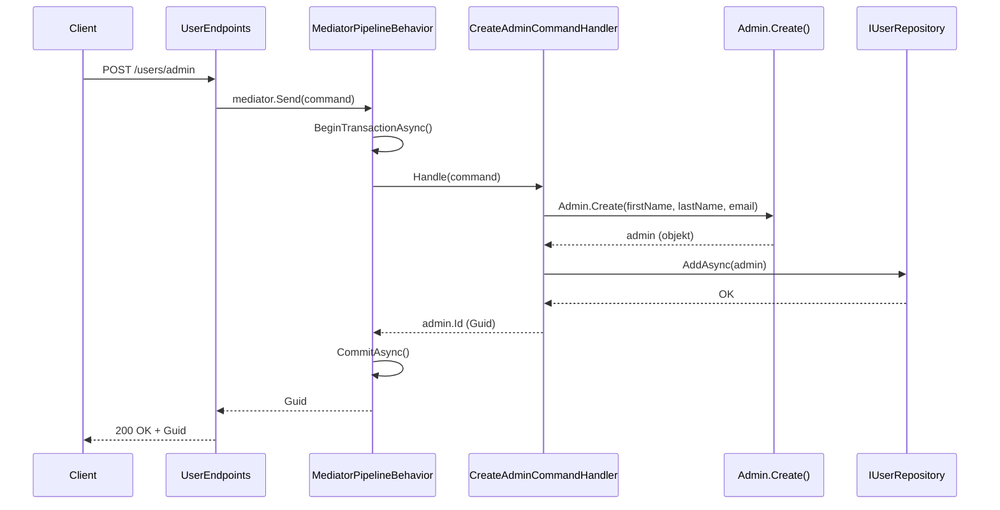
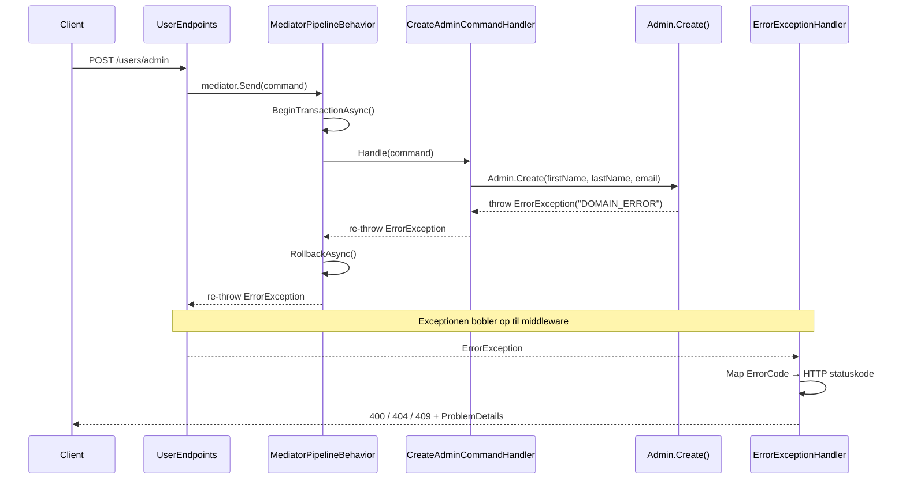

# Endpoint flow — request til response

Diagrammet viser hvad der sker fra klienten sender en request til den modtager et svar.
Eksemplet bruger `POST /users/admin`, men flowet er identisk for alle endpoints.

---

## Eksempel: Opret admin

### Request

```http
POST /users/admin
Content-Type: application/json

{
  "firstName": "Marge",
  "lastName": "Simpson",
  "email": "marge@springfield.com"
}
```

### Svar ved succes — 200 OK

```json
"a3f1c2d4-1234-5678-abcd-000000000001"
```

Svaret er den nye admins `Id` som en GUID. Den kan bruges til efterfølgende kald, fx `GET /users/{id}`.

### Svar ved fejl — 400 Bad Request (ugyldig email)

```json
{
  "title": "DOMAIN_ERROR",
  "status": 400,
  "detail": "Email format is invalid."
}
```

### Svar ved fejl — 404 Not Found (bruger findes ikke)

```json
{
  "title": "USER_NOT_FOUND",
  "status": 404,
  "detail": "User with id 'a3f1c2d4-...' was not found."
}
```

### Svar ved fejl — 409 Conflict (rollen er allerede tildelt)

```json
{
  "title": "ROLE_ALREADY_ASSIGNED",
  "status": 409,
  "detail": "The role Admin is already assigned to this user."
}
```

Fejlresponsen følger [RFC 9457 ProblemDetails](https://www.rfc-editor.org/rfc/rfc9457)-standarden — det er **ikke** `ErrorException` der serialiseres direkte. `ErrorExceptionHandler` oversætter `ErrorException` til `ProblemDetails` ved at trække specifikke felter ud:

| `ErrorException` (intern) | `ProblemDetails` (HTTP-svar til klient) |
|---|---|
| `ErrorCode` | `title` |
| `UserMessage ?? Message` | `detail` |
| `OccurredAt` | — (eksponeres ikke) |
| — | `status` (udledt fra `ErrorCode` via switch) |

`ErrorException` er altså den interne domænefejl. Klienten ser den aldrig direkte — kun det `ErrorExceptionHandler` vælger at oversætte til.

---

## Hvordan fungerer et endpoint — og hvad sker der når noget fejler?

### Selve endpoint-koden

```csharp
app.MapPost("/users/admin", async (IMediator mediator, CreateAdminCommand request) =>
{
    var result = await mediator.Send(request);
    return Results.Ok(result);
});
```

Endpoint-koden er bevidst kort. Den modtager en request, sender den videre til MediatR og returnerer `Results.Ok()`. Der er ingen fejlhåndtering her — og det er med vilje.

### Hvad sker der når `mediator.Send()` kaster en exception?

Når noget fejler inde i handleren eller domænelaget, kastes en `ErrorException`. På det tidspunkt **stopper eksekveringen øjeblikkeligt** — `Results.Ok()` nås aldrig. Exceptionen bobler op gennem call-stacken indtil ASP.NET Cores middleware-pipeline fanger den.

Det betyder at `Results.Ok()` **kun returneres hvis alt lykkedes**. Det er ikke muligt at nå `Results.Ok()` og samtidig have en fejl.

### Hvilken middleware overtager?

`ErrorExceptionHandler` — registreret i `Program.cs` som:

```csharp
builder.Services.AddExceptionHandler<ErrorExceptionHandler>();
app.UseExceptionHandler();
```

Denne middleware sidder som et net under alle endpoints. Når en exception bobler op, kalder ASP.NET Core automatisk `TryHandleAsync()`:

```csharp
public async ValueTask<bool> TryHandleAsync(HttpContext httpContext, Exception exception, ...)
{
    if (exception is not ErrorException errorException)
        return false; // ikke vores fejl — lad ASP.NET håndtere det

    var statusCode = errorException.ErrorCode switch
    {
        "USER_NOT_FOUND"       => 404,
        "ROLE_ALREADY_ASSIGNED"=> 409,
        "ROLE_NOT_FOUND"       => 404,
        _                      => 400
    };

    // Skriv ProblemDetails-svar til klienten
    await httpContext.Response.WriteAsJsonAsync(new ProblemDetails { ... });
    return true;
}
```

Den tjekker om exceptionen er en `ErrorException`. Hvis ja, mapper den `ErrorCode` til en HTTP statuskode og skriver et struktureret fejlsvar (ProblemDetails) tilbage til klienten. Hvis nej, returnerer den `false` og overlader det til ASP.NET Cores standardfejlhåndtering (500).

### Opsummering

| Situation | Hvad sker der | Klienten modtager |
|---|---|---|
| Alt lykkes | `Results.Ok(result)` returneres | 200 OK + data |
| `ErrorException` kastes | `Results.Ok()` nås aldrig — `ErrorExceptionHandler` overtager | 400 / 404 / 409 + ProblemDetails |
| Ukendt exception (fx databasefejl) | `ErrorExceptionHandler` returnerer `false` — ASP.NET overtager | 500 Internal Server Error |

---

## Happy path (gyldige data)



## Fejlpath (ugyldige data eller forretningsregel brudt)



## ErrorCode → HTTP statuskode mapping

| ErrorCode | HTTP statuskode |
|---|---|
| `USER_NOT_FOUND` | 404 Not Found |
| `ROLE_ALREADY_ASSIGNED` | 409 Conflict |
| `ROLE_NOT_FOUND` | 404 Not Found |
| Alle andre | 400 Bad Request |

## Vigtige detaljer

- **Endpoints returnerer altid `Results.Ok()`** — men den linje nås kun hvis ingen exception kastes. Ved fejl stopper eksekveringen før `Results.Ok()` og middlewaren overtager.
- **`MediatorPipelineBehavior`** håndterer transaction automatisk for commands der implementerer `ITransactionalCommand`. Ved exception rulles transaktionen tilbage.
- **`ErrorExceptionHandler`** er registreret som middleware i `Program.cs` og fanger alle `ErrorException`s på tværs af alle endpoints — ingen try/catch i selve endpoints.

---

## Hvad sker der ved de forskellige fejlscenarier?

### Ugyldige inputdata (fx tom streng eller ugyldig email)

Fejlen opstår i domænelaget når value objects som `Name` og `Email` validerer deres input i konstruktøren. Eksekveringen stopper der, transaktionen rulles tilbage, og klienten modtager **400 Bad Request**.

### Bruger findes ikke (GET /users/{id})

`UserRepository.GetByIdAsync()` kaster `ErrorException("USER_NOT_FOUND")` hvis ingen aktiv bruger har det givne id. Klienten modtager **404 Not Found**.

### Rollen er allerede tildelt (POST /users/{id}/roles)

Domænelogikken i `User.AssignRole()` tjekker om rollen allerede eksisterer. Hvis ja, kastes `ErrorException("ROLE_ALREADY_ASSIGNED")`. Klienten modtager **409 Conflict**.

### Ukendt fejl (fx databasefejl)

Hvis en exception *ikke* er en `ErrorException`, returnerer `ErrorExceptionHandler.TryHandleAsync()` `false` og lader ASP.NET Cores standardfejlhåndtering tage over med **500 Internal Server Error**. Disse logges men eksponeres ikke i detaljer til klienten.
